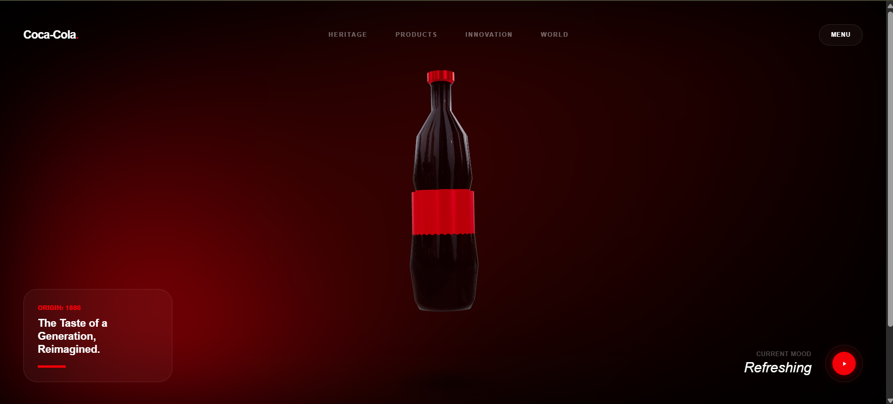
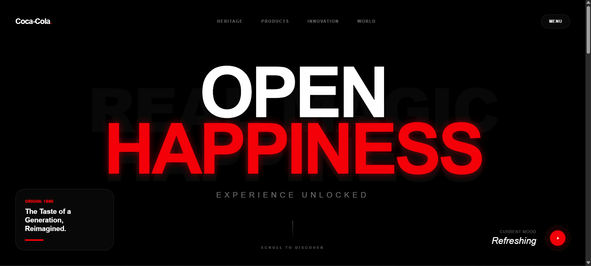
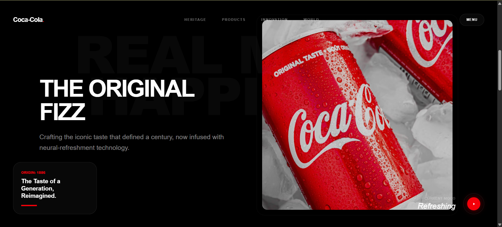

# 🥤 Coca-Cola: The Future of Refreshment


An immersive cinematic web experience that reimagines the futuristic identity of Coca-Cola.
Built using modern technologies with **3D interaction, smooth animations, and premium UI design**.

---

## 🎥 Preview

### 🔹 Hero Section



### 🔹 Opening Experience



### 🔹 3D Bottle Scene



---

## ✨ Features

* 🧊 Interactive 3D Coca-Cola bottle (React Three Fiber + Three.js)
* 🎬 Cinematic "Tap to Open" intro with audio & effects
* 🌀 Ultra-smooth scrolling (GSAP + Lenis)
* 🎨 Modern glassmorphism UI (Tailwind CSS 4)
* ⚡ High performance & responsive design

---

## 🛠️ Tech Stack

| Category      | Technologies                                    |
| ------------- | ----------------------------------------------- |
| Frontend      | React 19, TypeScript                            |
| 3D Rendering  | Three.js, @react-three/fiber, @react-three/drei |
| Animations    | GSAP, Motion                                    |
| Styling       | Tailwind CSS 4                                  |
| Smooth Scroll | Lenis                                           |

---

## 🚀 Getting Started

### 🔧 Prerequisites

* Node.js (LTS)
* npm / yarn

---

### 📦 Installation

```bash
git clone https://github.com/your-username/coca-cola-future.git
cd coca-cola-future
npm install
npm run dev
```

---

## 🌐 Live Demo

👉 https://your-live-link.vercel.app

---

## 📂 Project Structure

```text
src/
├── components/
│   ├── Three/
│   │   └── Bottle.tsx
│   ├── OpeningScene.tsx
│   ├── MainContent.tsx
│   └── SmoothScroll.tsx
├── App.tsx
└── index.css

public/
└── pop.mp3
```

---

## 🌐 Deployment (Vercel)

* Push code to GitHub
* Connect repo to Vercel
* Deploy instantly

---

## 👤 Author

**Gaurav Shiswar**

* 💻 Frontend Developer
* 🎓 B.Tech CSE (6th Semester)
* 📍 Bhopal, India

---

## 📄 License

Apache-2.0 License

---

## ⭐ Support

If you like this project, give it a ⭐ on GitHub!

---

## 🔥 Future Improvements

* 🌐 AR/VR experience
* 🎧 Advanced audio effects
* ⚡ Performance optimization
* 🤖 AI-based interaction

---

> "Not just a website — it's an experience."